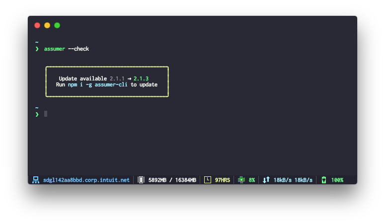

# assumer-cli
> Assume IAM roles between AWS accounts

[](https://nodei.co/npm/assumer-cli/)

[](https://snyk.io/test/github/petermbenjamin/assumer-cli)
[](https://nodesecurity.io/orgs/petermbenjamin/projects/380f367c-8901-4277-b402-55cdc0eff835)

## Features

- Interactive user prompt
- Account search autocompletion
- Generates & opens AWS Console URL in default browser
- Generates script for users to source in their current terminal session (supported platforms: Windows, Linux, Darwin)

## Install

```
npm i -g assumer-cli
```

## Usage

```
❯ assumer --help

  Assume IAM roles between AWS accounts

  Usage
    $ assumer
    $ assumer <flags>

  Required Flags
    -a, --target-account    Target Account Number
    -r, --target-role       Target Account Role
    -A, --control-account   Control Account Number
    -R, --control-role      Control Account Role

  Optional Flags
    -u, --username          An AWS IAM username (defaults to system user name)
    -g, --gui               Open a web browser to the AWS console with these credentials
    -t, --token             MFA Token (you will be interactively prompted)
    --check                 Check for new versions

  Example
    $ assumer # interactive mode
    $ assumer -a 111111111111 -r target/role -A 123456789012 -R control/role
```

### Examples
- If you know the account numbers and role names you wish to assume:
  ```
  $ assumer -a <target-account> -r <target-role> -A <control-account> -R <control-role>
  ```
- If you don't know the account numbers and role names:
  ```
  $ assumer
  ```
- To check if there is a new version of `assumer-cli`:
  ```
  $ assumer --check
  ```
  

## Configuration

If you want to use the CLI in interactive mode, `assumer` expects a config file called `.assumer.json` in your home directory.
Sample configuration:
```json
{
  "control": {
    "accounts": [
      {
        "name": "Control Account",
        "value": "123456789012"
      }
    ],
    "roles": [
      {
        "name": "Deploy Admin",
        "value": "deployment/admin"
      },
      {
        "name": "Super Admin",
        "value": "security/admin"
      },
      {
        "name": "Read Only",
        "value": "read/only"
      }
    ]
  },
  "target": {
    "roles": [
      {
        "name": "Deploy Admin",
        "value": "deployment/admin"
      },
      {
        "name": "Super Admin",
        "value": "security/admin"
      },
      {
        "name": "Read Only",
        "value": "read/only"
      }
    ],
    "accounts": [
      {
        "name": "target-account-1",
        "value": "111111111111"
      },
      {
        "name": "target-account-2",
        "value": "222222222222"
      }
    ]
  }
}
```
See [sample config file](.assumer.sample.json) for reference.

## Related
- [assumer-js](https://github.com/devsecops/assumer-js) - API for this module

## License

MIT © [Peter Benjamin](https://petermbenjamin.github.io/)
